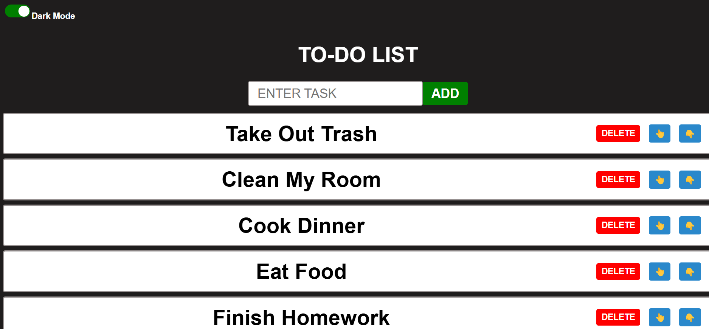

## 📋 To-Do List Project:

- A simple yet interactive To-Do List application with dark mode support and task management functionality.

## 😧 Features:
- ✅ Add Tasks: Enter a task and add it to the list.
- ❌ Delete Tasks: Remove tasks with a red delete button.
- ✍️ Move Tasks: Up and down buttons for task management.
- 🌙 Dark Mode Toggle: Switch between light and dark mode.
- 💾 Saved Tasks: Tasks are saved in local storage to prevent tasks from being reset if website refreshes.

##  📸 Screenshot: 
- 

##  🌍 LIVE DEMO:
- Try it Out: https://chrisw0987.github.io/To-Do-List/

## 🛠 Tech Stack:
- **Frontend:** React.js, Vite
- **Styling:** CSS, Animations
- **Tools**: GitHub, VS Code


## 📦 Installation:
1. Clone the repository:
   ```bash
   git clone https://chrisw0987.github.io/To-Do-List/
2. cd To-Do-List
3. npm install
4. npm run dev
